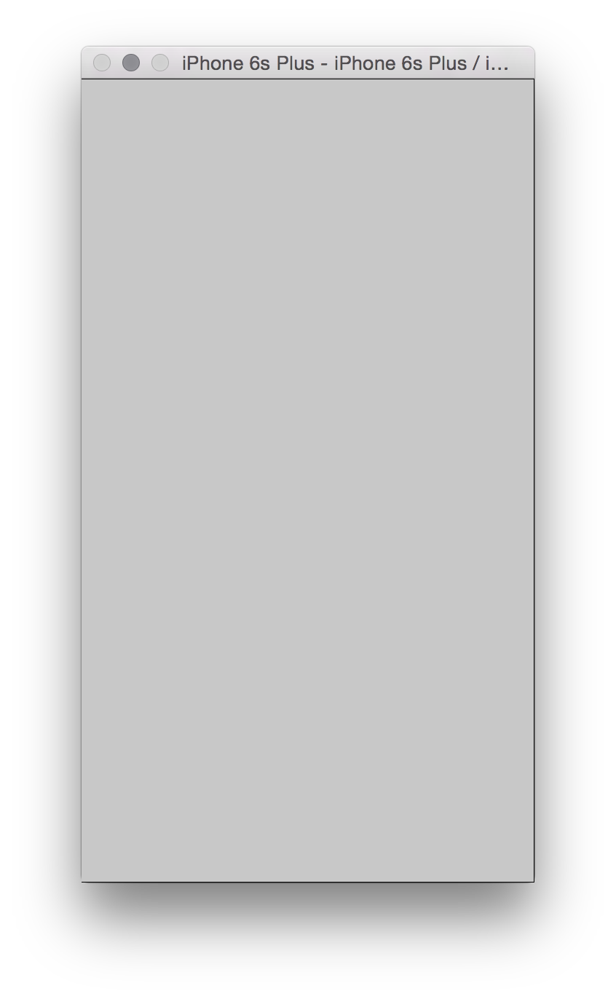

# About Lettering Practice

### Learning Objectives

This example is the simplest possible openFrameworks app! It does nothing.  

...Well, *almost* nothing. Although it may not be apparent, the emptyExample activates all of the default system states. (For example, it sets the default fill color to white; it just doesn't happen to draw anything with it.)

The emptyExample is great for making sure that your openFrameworks development environment is compiling properly. It can also be useful as a "starter template" for making simple programs.

The emptyExample will help you understand what are the bare necessities of an openFrameworks program. In this regard, you can think of it as a "Hello World" for OF.

This variation on the original emptyExample sets up the bare necessities for an iOS application environment.

### Expected Behavior

When launching this app, you should see a light-gray screen.

* There's no interaction.
* There's nothing to see.
* That's it.

Instructions for using the app:

* There's nothing to do. Move along.

### Other classes used in this file

This Example uses the following classes:

* [ofxiOS](http://openframeworks.cc/documentation/ofxiOS/) (for compiling openFrameworks to an Apple iOS device)
